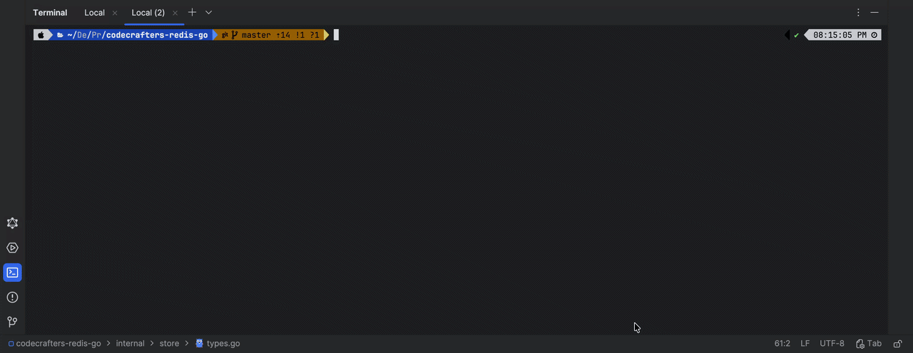

# Redis — Go Implementation


A from-scratch Redis server and interactive client CLI written in Go. **Credits:** [Build Your Own Redis Challenge : CodeCrafters](https://codecrafters.io/challenges/redis)



---

## What's in this repo

| Binary | Path | Description |
|---|---|---|
| `redis-server` | `app/` | Full Redis server : RESP protocol, persistence, replication, pub/sub |
| `redis-cli` | `cmd/redis-cli/` | Rich interactive client : TUI REPL, autocomplete, live pub/sub feed |

---

## Server

### Run

```sh
# Default (port 6379)
go run ./app/

# Custom port
go run ./app/ --port 6380

# With RDB persistence
go run ./app/ --port 6379 --dir /tmp --dbfilename dump.rdb

# With AOF persistence
go run ./app/ --port 6379 --appendonly yes --appendfilename appendonly.aof

# As a replica
go run ./app/ --port 6380 --replicaof "127.0.0.1 6379"
```

### Supported commands

| Category | Commands |
|---|---|
| Basic | `PING` `ECHO` `TYPE` `INFO` |
| String | `SET` `GET` `INCR` `DECR` |
| List | `LPUSH` `RPUSH` `LPOP` `RPOP` `LLEN` `LRANGE` `BLPOP` |
| Stream | `XADD` `XRANGE` `XREAD` |
| Sorted set | `ZADD` `ZRANGE` `ZRANK` `ZSCORE` `ZCARD` `ZREM` |
| Geo | `GEOADD` `GEOPOS` `GEODIST` `GEOSEARCH` |
| Pub/Sub | `SUBSCRIBE` `PSUBSCRIBE` `UNSUBSCRIBE` `PUNSUBSCRIBE` `PUBLISH` |
| Transaction | `MULTI` `EXEC` `DISCARD` `WATCH` `UNWATCH` |
| Replication | `REPLCONF` `PSYNC` `WAIT` |
| ACL / Auth | `AUTH` `ACL` |
| Config / Keys | `CONFIG` `KEYS` |

**Concurrency model:** each client connection runs in its own goroutine; the store is protected by `sync.RWMutex` so reads run concurrently and writes are serialised — similar to Redis but via OS threads instead of an event loop.

---

## CLI

### Run

```sh
# Connect to local server
go run ./cmd/redis-cli/

# Custom host / port / password
go run ./cmd/redis-cli/ --host 127.0.0.1 --port 6380 --password secret

# Scripted demo (good for recording)
go run ./cmd/redis-cli/ --demo
```

### Features

- **Startup banner** — ASCII logo, connection status, ping latency, server version
- **Autocomplete** — fuzzy command suggestions with synopsis, context-aware (suppressed during pub/sub)
- **Typo correction** — Levenshtein distance hint when a command isn't recognised
- **Color-coded output** — ✓ green for OK, ✗ red for errors, cyan integers, dim nil
- **Sorted set tables** — `ZRANGE ... WITHSCORES` renders as an aligned member/score table
- **Stream cards** — `XRANGE`/`XREAD` renders each entry with ID and field/value rows
- **GEO tables** — `GEOPOS`/`GEODIST` rendered as labelled coordinate tables
- **Transaction mode** — prompt changes to `TX›` (yellow), queued commands show `⬡ QUEUED`
- **Pub/Sub live feed** — Bubble Tea view with timestamped `🔔` messages, `Ctrl+C` to exit and unsubscribe
- **Built-in help** — `HELP` lists all commands by category; `HELP <cmd>` shows synopsis and example
--- 

## Build

```sh
# Build both binaries
go build -o redis-server ./app/
go build -o redis-cli    ./cmd/redis-cli/

# Run all tests
go test ./...
```
---

[](https://app.codecrafters.io/users/codecrafters-bot?r=2qF)

